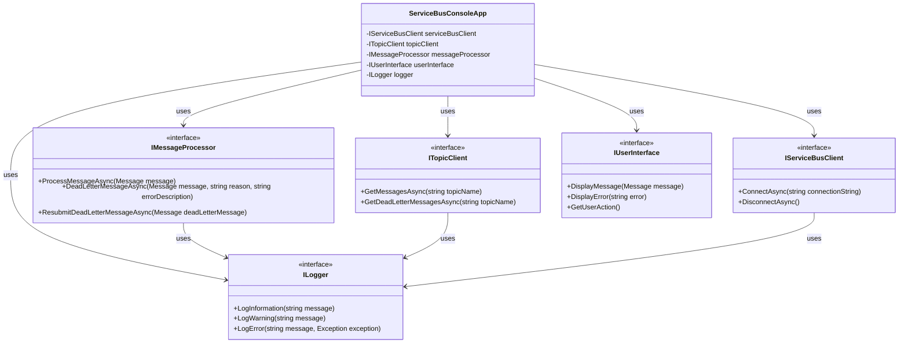

# Frank.ServiceBusExplorer
Yes

## Visualiaztion

```mermaid
classDiagram
    class ServiceBusConsoleApp {
        -IServiceBusClient serviceBusClient
        -ITopicClient topicClient
        -IMessageProcessor messageProcessor
        -IUserInterface userInterface
        -ILogger logger
    }

    class IServiceBusClient {
        <<interface>>
        +ConnectAsync(string connectionString)
        +DisconnectAsync()
    }

    class ITopicClient {
        <<interface>>
        +GetMessagesAsync(string topicName)
        +GetDeadLetterMessagesAsync(string topicName)
    }

    class IMessageProcessor {
        <<interface>>
        +ProcessMessageAsync(Message message)
        +DeadLetterMessageAsync(Message message, string reason, string errorDescription)
        +ResubmitDeadLetterMessageAsync(Message deadLetterMessage)
    }

    class IUserInterface {
        <<interface>>
        +DisplayMessage(Message message)
        +DisplayError(string error)
        +GetUserAction()
    }

    class ILogger {
        <<interface>>
        +LogInformation(string message)
        +LogWarning(string message)
        +LogError(string message, Exception exception)
    }

    ServiceBusConsoleApp --> IServiceBusClient : uses
    ServiceBusConsoleApp --> ITopicClient : uses
    ServiceBusConsoleApp --> IMessageProcessor : uses
    ServiceBusConsoleApp --> IUserInterface : uses
    ServiceBusConsoleApp --> ILogger : uses
    IMessageProcessor --> ILogger : uses
    ITopicClient --> ILogger : uses
    IServiceBusClient --> ILogger : uses

```